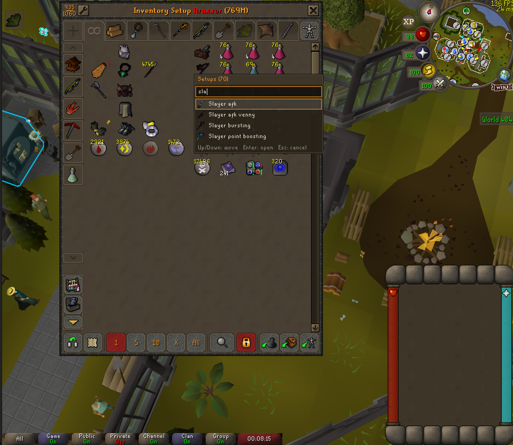
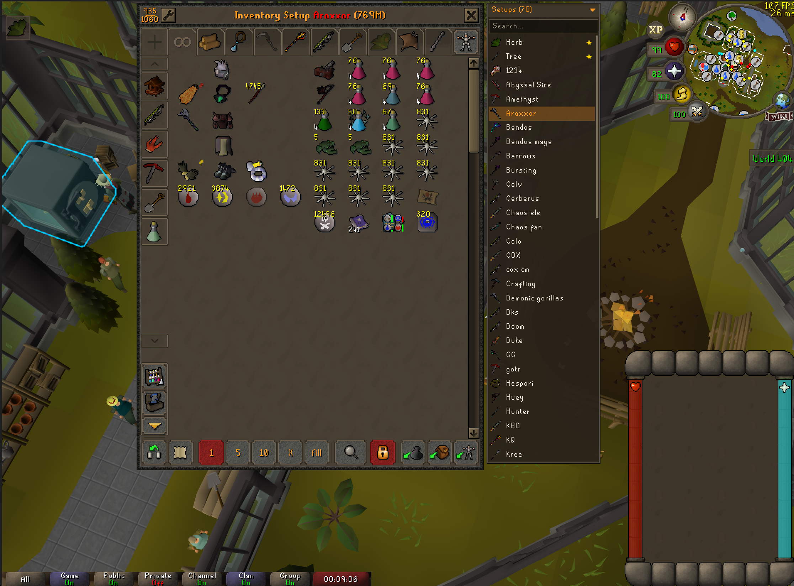

# Inventory Setups Picker

A companion to the [Inventory Setups](https://github.com/dillydill123/inventory-setups) plugin that lets you open
your setups from inside the game instead of the side panel.

## Hotkey popup

Press **Cmd+K** (Mac) or **Ctrl+K** (Windows/Linux) anywhere in game to open a list of all your setups. The key
can be changed, and the modifier turned off, in the plugin's settings. If you use the
[Platform Keys](https://github.com/akump/platform-keys) plugin, the modifier follows its key profile, so the
shortcut matches its bank search.

| Key | Action |
| --- | --- |
| Type | Filter setups by name |
| `Up` / `Down`, `Tab` / `Shift+Tab` | Move the selection |
| `Page Up` / `Page Down` | Move a page at a time |
| `Enter` | Open the selected setup (or close it, if it's the one already open) |
| `Esc`, the hotkey again, or clicking elsewhere | Cancel |

While the popup is open, typing goes to it rather than to the chatbox.

## Beside the bank

While the bank is open the same list is shown next to it. Click a setup to open it, click the open setup to close
it, click the search box to filter, scroll with the mouse wheel, and click the title bar to collapse the list. This
can be turned off in the plugin's settings.

## Requirements

Inventory Setups must be installed and enabled. Setups are listed alphabetically
(optionally favorites first), with the icon and color you gave them there.

## Development

`./gradlew runClient` starts RuneLite with the plugin loaded. `./gradlew test` also writes a rendering of both
views to `build/preview.png`.
