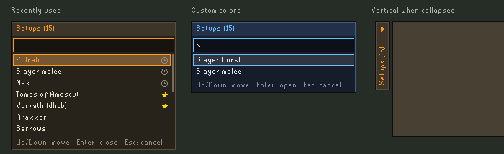

# Inventory Setups Picker

A companion to the [Inventory Setups](https://github.com/dillydill123/inventory-setups) plugin that lets you open
your setups from inside the game instead of the side panel. It can also list your Bank Tag tabs and open them with
their layouts, on their own or alongside your setups.

## Hotkey popup

Press **Cmd+K** (Mac) or **Ctrl+K** (Windows/Linux) anywhere in game to open a list of all your setups. The key
can be changed, and the modifier turned off, in the plugin's settings. If you use the
[Platform Keys](https://github.com/akump/platform-keys) plugin, the modifier follows its key profile, so the
shortcut matches its bank search.

| Key | Action |
| --- | --- |
| Type | Filter setups by name |
| `Up` / `Down`, `Tab` / `Shift+Tab` | Move the selection |
| `Page Up` / `Page Down` | Move a page at a time |
| `Enter` | Open the selected setup (or close it, if it's the one already open) |
| `Left` / `Right`, `Home` / `End` | Move the cursor through the search text |
| `Backspace` / `Delete` | Delete the character before / after the cursor |
| `Ctrl+A` / `Cmd+A` | Highlight the search text, so typing replaces it and `Backspace` clears it |
| `Esc`, the hotkey again, or clicking elsewhere | Cancel |

While the popup is open, typing goes to it rather than to the chatbox, including keys that Key Remapping or
Platform Keys would otherwise turn into something else.

If a setup is already open, the popup starts with it selected, so the hotkey followed by `Enter` closes it. Turn
off **Start on open setup** to always start at the top of the list.

## Beside the bank

While the bank is open the same list is shown next to it. Click a setup to open it, click the open setup to close
it, click the search box to filter, scroll with the mouse wheel, and click the title bar to collapse the list. This
can be turned off in the plugin's settings.

Collapsed, the list shrinks to its title bar. With **Vertical when collapsed** turned on it becomes a narrow
upright tab against the bank's edge instead.

On a small client the list can reach down over the inventory. Set **Max rows** to limit how many rows it shows;
the rest are scrolled to.

### Moving it

The list can be dragged anywhere by its title bar, which has a grip of six dots at its left end, and stays where
you leave it relative to the bank. A click on the title bar without moving still collapses and expands it. Away
from the bank's side, the list runs as far down as the client does unless **Max rows** limits it, and collapses to
its title bar. To put it back beside the bank, right-click its title bar, or change the **Bank side** setting.

## Sections

If you sort your setups into sections in Inventory Setups, both lists group them the same way: a heading per
section, in the side panel's order, with the setups that aren't in any section under "Unassigned". A setup that is
in several sections is listed under each. Typing a section's name lists all of its setups. This can be turned off
in the plugin's settings to get one flat list.

With **Sections as pages** turned on in the settings, the lists show just the sections instead. Click a section, or
select it and press `Enter`, to see its setups on a page of their own, and click its name at the top, or press
`Left` or `Backspace` in an empty search box, to go back. Typing on a section's page searches that section; typing in the list of sections
still searches every setup.

## Bank tags and layouts

The **List** setting chooses what the lists show: your setups from Inventory Setups (the default), your tag tabs
from RuneLite's Bank Tags plugin, or both. Picking a bank tag opens it, along with its layout if it has one, the
same as clicking its tab. Picking the tag that is already open leaves it open.

With both listed, each row is marked with where it is from: a little person for a setup, a tag for a bank
tag. Bank tags have no sections, so when the list is grouped by section they go under a "Bank tags" heading after
your sections and "Unassigned". A setup and a tag with the same name are listed separately.

Bank tags have no color or favorite flag. Tags opened from their tabs count as recently used too.

## Notes

With **Show notes** turned on, setups that have notes in Inventory Setups are marked with a small page. The notes
of the setup that is selected in the popup, or under the mouse in either list, are shown in a box beside the list,
level with the setup. Beside the bank, the box goes on the side away from the bank when there is room.
Long notes are cut short after eight lines.

## Spellbook

With **Show spellbook** turned on, a line under the bank's bottom right corner says which spellbook the open setup
is for, such as "Lunar spellbook". When you are on a different one it reads "Needs Lunar spellbook" in red. Nothing is shown for setups
whose spellbook is set to none in Inventory Setups, or that aren't filtering the bank.

## Options at a glance

## Ordering and search

Setups are shown with the icon and color you gave them in Inventory Setups, and a star if they are a favorite.

- **Sort alphabetically** (on by default): list setups by name. Turn it off to keep the order of the Inventory
  Setups side panel.
- **Favorites first** (on by default): list favorited setups before the rest.
- **Recently used** (off by default): set how many of the setups you opened most recently, up to 10, to list at
  the top, latest first and marked with a clock. With "Group by section" on they get a "Recent" heading and stay
  in their own sections too. Setups opened from the Inventory Setups side panel count as well.
- **Fuzzy search** (on by default): when a search finds nothing as typed, it also matches names that are a typo
  away (`vorkahh`) or that have the typed letters in order (`vkdh`). Searches that do match are unaffected.

## Colors

The **Colors** section of the settings changes the background, title bar, border, accent and text colors of both
lists, each with a color picker that takes a hex code, for matching a resource pack. To put one back, right-click
its name in the settings and choose "Reset".

## Settings

| Setting | Default | What it does |
| --- | --- | --- |
| List | Inventory Setups | What to list: Inventory Setups, Bank Tags (opened with their layouts), or both. |
| Open hotkey | K | The key that opens the popup. Only the key is used; the modifier comes from the next setting. |
| Require Ctrl/Cmd | On | Require Cmd (Mac) or Ctrl (Windows/Linux) with the hotkey. Follows Platform Keys' key profile when that plugin is on. |
| Start on open setup | On | Open the popup with the already open setup selected. |
| Popup rows | 10 | How many rows the popup shows before it scrolls. |
| Show icons | On | Show each setup's icon next to its name. |
| Show notes | Off | Mark setups that have notes, and show the notes of the selected or hovered one beside the list. |
| Sort alphabetically | On | List setups by name instead of in the side panel's order. |
| Favorites first | On | List favorited setups before the rest. |
| Recently used | 0 | How many recently opened setups to list at the top. 0 turns it off. |
| Fuzzy search | On | Allow for typos and skipped letters when a search finds nothing as typed. |
| Group by section | On | List setups under their Inventory Setups sections. |
| Sections as pages | Off | List just the sections, and open one to see its setups. |
| Show beside bank | On | Show the list next to the bank while it is open. |
| Bank side | Left | Which side of the bank the list sits on. It moves to the other side when there is no room. Changing it also puts a list you have dragged elsewhere back beside the bank. |
| Width | 160 | Width of the list beside the bank, in pixels. |
| Max rows | 0 | The most rows the list beside the bank shows before it scrolls. 0 lets it run as far down as the bank does, or as the client does once it has been dragged elsewhere. |
| Show spellbook | Off | Say under the bank's bottom right corner which spellbook the open setup is for, in red when you're on another. |
| Vertical when collapsed | Off | Collapse the list beside the bank to an upright tab instead of its title bar. A list that has been dragged elsewhere always collapses to its title bar. |
| Colors | | Background, title bar, border, accent and text colors. |
| Open Ko-fi page | | Click to open the plugin's Ko-fi page in your browser. |

## Update messages

After an update that adds something, the plugin says so in the chatbox the next time you log in. Each message is
shown once per RuneLite profile.

## Requirements

Inventory Setups must be installed and enabled to list setups, and RuneLite's Bank Tags plugin enabled to list
bank tags. The picker lists and opens what you keep there; it does not store any setups or tags of its own.

## Credits

The Bank Tags support is based on Bank Tag Picker by **Ian-Fund**, a fork of this plugin that lists and opens
Bank Tag tabs and their layouts. Thanks to Ian-Fund for that work.

## Support

If the plugin is useful to you, you can [buy me a coffee on Ko-fi](https://ko-fi.com/andrewkump).

## Development

`./gradlew runClient` starts RuneLite with the plugin loaded. `./gradlew test` also writes a rendering of both
views to `build/preview.png`, and of setups and bank tags listed together to `build/preview-mixed.png`.
